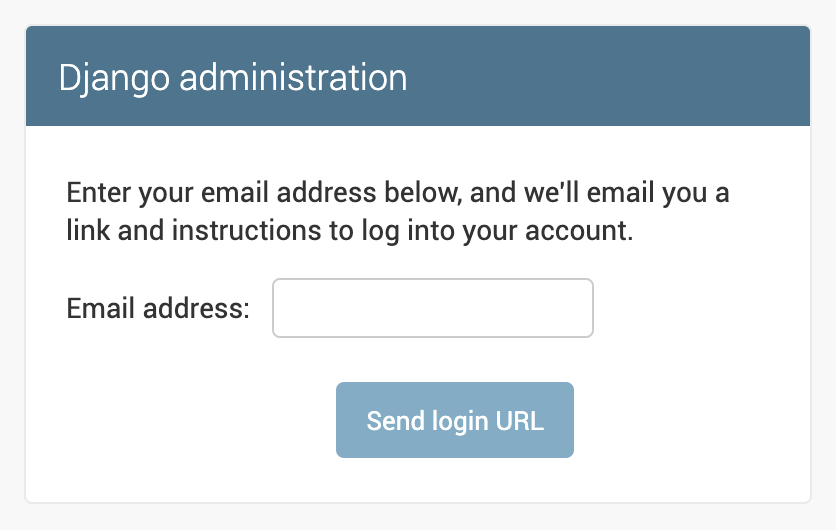

=================
Django noPassword
=================

noPassword is a lightweight authentication backend for Django,
that does not require users to remember passwords.

Django noPassword features:

- custom user model support
- very light weight
- extendable

This project was originally inspired by `Is it time for password-less login?`__ by `Ben Brown`_.

__ http://notes.xoxco.com/post/27999787765/is-it-time-for-password-less-login
.. _`Ben Brown`: http://twitter.com/benbrown

Installation
------------

Run this command to install ``django-nopassword``::

    pip install django-nopassword

Setup
-----

First add `nopassword` to you installed apps::

    INSTALLED_APPS = [
        # Django's builtin apps…

        'nopassword',
        'nopassword.contrib.admin',  # optional

        # other apps…
    ]

`nopassword.contrib.admin` is optional and will replace the admin's login
with token based authentication too.

Next you will need to add the new authentication backend::

        AUTHENTICATION_BACKENDS = (
        # default, but now optional
        'django.contrib.auth.backends.ModelBackend',

        # The new access token based authentication backend
        'nopassword.backends.NoPasswordBackend',
    )

Django's `ModelBackend` is only only needed, if you still want to support
password based authentication. If you don't, simply remove it from the list.

Last but not least, go to your URL root config `urls.py` and add the following::

    from django.urls import path

    urlpatterns = [
        path('accounts/', include('nopassword.urls')),
    ]

That's it!

.. note:: Don't forget to setup you Email backend!
